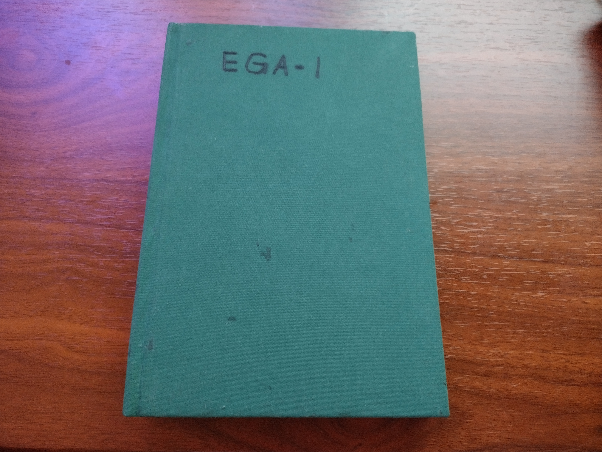
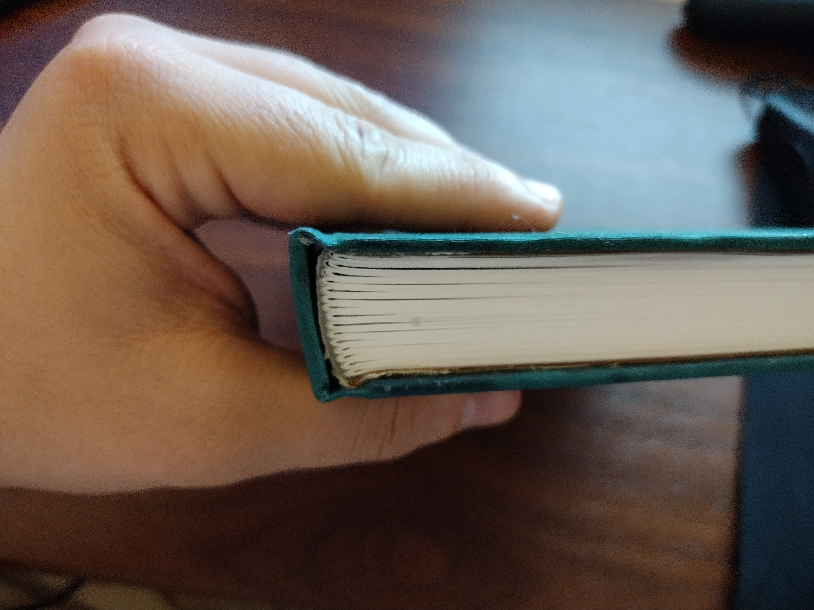
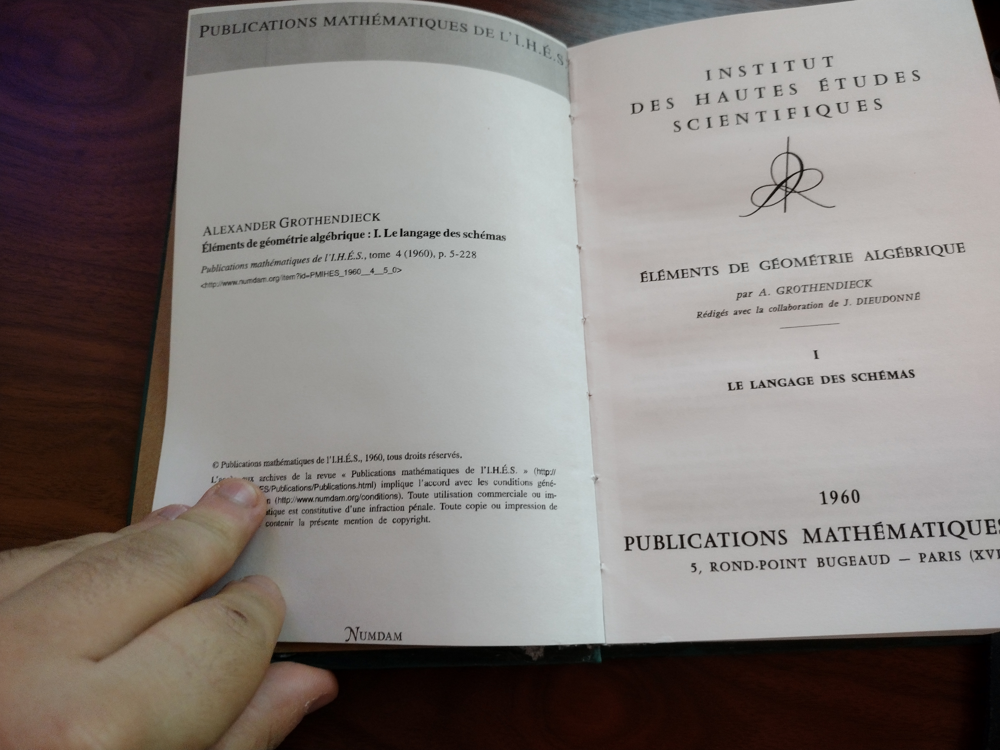

I wrote this short program in order to print a personal copy of EGA. Here's how it turned out:

 | 
|---|----|
 | 

There are a few issues -- you can see the bottom stitch got cut off when I was
trimming the edges. The cover's pretty messy. The thread I used to stitch was
too thick, so the stitched side is thicker than the stack of pages, which leads
to more issues. The scan by Numdam has a few pages off center, so some margins
are very close to the edge of the paper. My second attempt with Ravi Vakil's
Rising Sea algebraic geometry notes (parts I and II) turned out better. I'm
hoping both books will hold up well over time.

The program itself takes a normal pdf, reorders the pages, and puts two per
side (four per piece of paper) so that you can stack them up in 'signatures',
fold each signature in in half, and then stitch the signatures together to
create the inside of a book.

Essentially, if you the following pdf,
```
[--] [--] [--] [--] [--] [--]
[--] [--] [--] [--] [--] [--] ...
[-1] [-2] [-3] [-4] [-5] [-6]
```
And you want signatures with two pages each, the program creates this pdf:
```
[----] [----] [----] [----] [----]
[----] [----] [----] [----] [----] ...
[-8-1] [-2-7] [-6-3] [-4-5] [15-9]
```
So the first signature looks like this from the side before being folded:
```
 8   1 
------
7   2
 6   3
------
5   4
```
after being folded:
```
       1
  ------
  | 2
  |     3
  | ------
  | | 4
  | |   5
  | ------
  |  6
  |     7
  -------
    8
```

You will have to pay attention to flipping on the long edge vs. the short edge
while printing.

Also, the last signature will not have fewer pages, so you might end up
with a lot of blank pages at the end.

The command-line options can be viewed using the `--help` flag. If running using
`cargo run`, make sure to put the options for the program after a `--`:
```
cargo run -- --help
```
```
cargo run -- input.pdf output.pdf --signatures 4 --pad-start 2 --clean
```
The program uses several different command-line utilities as well as a rust
library. If you get errors, you not have some of the utilities. I only tested on
linux.
